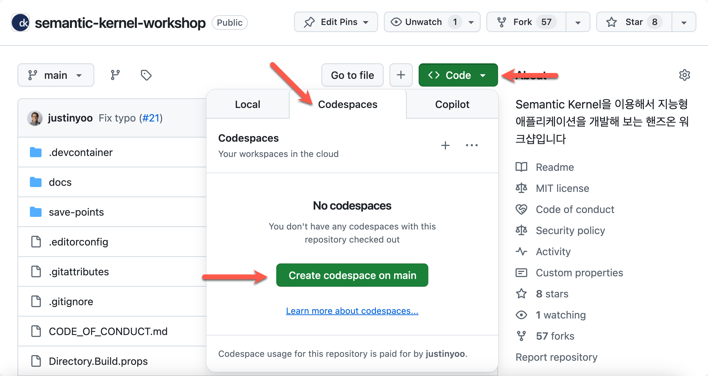

# STEP 00: 개발 환경 설정하기

이 단계에서는 워크샵 진행을 위해 필요한 개발 환경을 설정합니다.

## 사전 준비 사항

- [.NET SDK 9](https://dotnet.microsoft.com/download/dotnet/9.0) 설치
- [PowerShell 7](https://learn.microsoft.com/powershell/scripting/install/installing-powershell) 설치
- [git CLI](https://git-scm.com/downloads) 설치
- [GitHub CLI](https://cli.github.com/) 설치
- [Docker Desktop](https://docs.docker.com/get-started/introduction/get-docker-desktop/) 설치
- [Visual Studio Code](https://code.visualstudio.com/) 설치
- [Google Gemini API Key](https://ai.google.dev/gemini-api/docs/api-key) 생성
- [GitHub Personal Access Token](https://github.com/settings/tokens) 생성

## GitHub Codespaces로 시작하기



위 이미지를 따라 차례로 `[<> Code]` 👉 `[Codespaces]` 👉 `[Create codespace on main]`를 클릭해서 GitHub Codespaces 인스턴스를 생성합니다. 네트워크 사정에 따라 대략 5분-10분 정도 걸립니다.

GitHub Codespaces 인스턴스가 만들어지면 [Google Gemini API Key 생성](#google-gemini-api-key-생성) 섹션으로 이동합니다.

## .NET SDK 설치 확인

1. 터미널에서 아래 명령어를 실행시켜 현재 .NET SDK를 설치했는지 확인합니다.

    ```bash
    # Bash/Zsh
    which dotnet
    ```

    ```bash
    # PowerShell
    Get-Command dotnet
    ```

   `dotnet`을 실행시킬 수 있는 경로가 보이지 않는다면 설치하지 않은 것입니다. 만약 설치하지 않았다면 [.NET SDK 설치 페이지](https://dotnet.microsoft.com/download/dotnet/9.0)에서 최신 버전을 다운로드 받아 설치합니다.

1. 터미널에서 아래 명령어를 실행시켜 현재 설치한 .NET SDK 버전을 확인합니다.

    ```bash
    dotnet --list-sdks
    ```

   `9.0.100` 이상의 버전이 보여야 합니다. 없을 경우 [.NET SDK 설치 페이지](https://dotnet.microsoft.com/download/dotnet/9.0)에서 최신 버전을 다운로드 받아 설치합니다.

1. 아래 명령어를 실행시켜 로컬머신 개발용 HTTPS 인증서를 설치합니다.

    ```bash
    dotnet dev-certs https --trust
    ```

1. 아래 명령어를 실행시켜 .NET Aspire 프로젝트 템플릿을 최신으로 업데이트합니다.

    ```bash
    dotnet new install Aspire.ProjectTemplates --force
    ```

## PowerShell 설치 확인

1. 터미널에서 아래 명령어를 실행시켜 현재 PowerShell을 설치했는지 확인합니다.

    ```bash
    # Bash/Zsh
    which pwsh
    ```

    ```bash
    # PowerShell
    Get-Command pwsh
    ```

   `pwsh`을 실행시킬 수 있는 경로가 보이지 않는다면 설치하지 않은 것입니다. 만약 설치하지 않았다면 [PowerShell 설치 페이지](https://learn.microsoft.com/powershell/scripting/install/installing-powershell)에서 최신 버전을 다운로드 받아 설치합니다.

1. 터미널에서 아래 명령어를 실행시켜 현재 설치한 PowerShell 버전을 확인합니다.

    ```bash
    pwsh --version
    ```

   `7.4.0` 이상의 버전이 있어야 합니다. 만약 이보다 버전이 낮다면 [PowerShell 설치 페이지](https://learn.microsoft.com/powershell/scripting/install/installing-powershell)에서 최신 버전을 다운로드 받아 설치합니다.

## git CLI 설치 확인

1. 터미널에서 아래 명령어를 실행시켜 현재 git CLI를 설치했는지 확인합니다.

    ```bash
    # Bash/Zsh
    which git
    ```

    ```bash
    # PowerShell
    Get-Command git
    ```

   `git`을 실행시킬 수 있는 경로가 보이지 않는다면 설치하지 않은 것입니다. 만약 설치하지 않았다면 [git CLI 설치 페이지](https://git-scm.com/downloads)에서 최신 버전을 다운로드 받아 설치합니다.

1. 터미널에서 아래 명령어를 실행시켜 현재 설치한 git CLI 버전을 확인합니다.

    ```bash
    git --version
    ```

   `2.39.0` 이상의 버전이 있어야 합니다. 만약 이보다 버전이 낮다면 [git CLI 설치 페이지](https://git-scm.com/downloads)에서 최신 버전을 다운로드 받아 설치합니다.

## GitHub CLI 설치 확인

1. 터미널에서 아래 명령어를 실행시켜 현재 GitHub CLI를 설치했는지 확인합니다.

    ```bash
    # Bash/Zsh
    which gh
    ```

    ```bash
    # PowerShell
    Get-Command gh
    ```

   `gh`을 실행시킬 수 있는 경로가 보이지 않는다면 설치하지 않은 것입니다. 만약 설치하지 않았다면 [GitHub CLI 설치 페이지](https://cli.github.com/)에서 최신 버전을 다운로드 받아 설치합니다.

1. 터미널에서 아래 명령어를 실행시켜 현재 설치한 GitHub CLI 버전을 확인합니다.

    ```bash
    gh --version
    ```

   `2.65.0` 이상의 버전이 있어야 합니다. 만약 이보다 버전이 낮다면 [GitHub CLI 설치 페이지](https://cli.github.com/)에서 최신 버전을 다운로드 받아 설치합니다.

1. GitHub에 로그인 했는지 확인합니다.

    ```bash
    gh auth status
    ```

   만약 로그인하지 않았다고 나온다면, `gh auth login` 명령어를 통해 로그인합니다.

## Docker Desktop 설치 확인

1. 터미널에서 아래 명령어를 실행시켜 현재 Docker Desktop을 설치했는지 확인합니다.

    ```bash
    # Bash/Zsh
    which docker
    ```

    ```bash
    # PowerShell
    Get-Command docker
    ```

   `docker`을 실행시킬 수 있는 경로가 보이지 않는다면 설치하지 않은 것입니다. 만약 설치하지 않았다면 [Docker Desktop 설치 페이지](https://docs.docker.com/get-started/introduction/get-docker-desktop/)에서 최신 버전을 다운로드 받아 설치합니다.

1. 터미널에서 아래 명령어를 실행시켜 현재 설치한 Docker Desktop 버전을 확인합니다.

    ```bash
    docker --version
    ```

   `27.4.0` 이상의 버전이 있어야 합니다. 만약 이보다 버전이 낮다면 [Docker Desktop 설치 페이지](https://docs.docker.com/get-started/introduction/get-docker-desktop/)에서 최신 버전을 다운로드 받아 설치합니다.

## Visual Studio Code 설치 확인

1. 터미널에서 아래 명령어를 실행시켜 현재 Visual Studio Code를 설치했는지 확인합니다.

    ```bash
    # Bash/Zsh
    which code
    ```

    ```bash
    # PowerShell
    Get-Command code
    ```

   `code`을 실행시킬 수 있는 경로가 보이지 않는다면 설치하지 않은 것입니다. 만약 설치하지 않았다면 [Visual Studio Code 설치 페이지](https://code.visualstudio.com/)에서 최신 버전을 다운로드 받아 설치합니다.

1. 터미널에서 아래 명령어를 실행시켜 현재 설치한 Visual Studio Code 버전을 확인합니다.

    ```bash
    code --version
    ```

   `1.96.0` 이상의 버전이 있어야 합니다. 만약 이보다 버전이 낮다면 [Visual Studio Code 설치 페이지](https://code.visualstudio.com/)에서 최신 버전을 다운로드 받아 설치합니다.

   > 만약 터미널에서 `code` 명령어를 실행시킬 수 없다면, [이 문서](https://code.visualstudio.com/docs/setup/mac#_launching-from-the-command-line)를 참고하여 설정합니다.

## Visual Studio Code 시작

1. 작업할 디렉토리로 이동합니다.
1. 터미널에서 아래 명령어를 실행시켜 이 리포지토리를 자신의 GitHub 계정으로 포크한 후 자신의 컴퓨터로 클론합니다.

    ```bash
    gh repo fork matdaaiga-kr/semantic-kernel-workshop --clone
    ```

1. 터미널에서 아래 명령어를 실행시켜 클론한 디렉토리로 이동합니다.

    ```bash
    cd semantic-kernel-workshop
    ```

1. 터미널에서 아래 명령어를 실행시켜 Visual Studio Code를 실행시힙니다.

    ```bash
    code .
    ```

1. Visual Studio Code에서 터미널을 열고 아래 명령어를 실행시켜 현재 리포지토리의 클론 상태를 확인합니다.

    ```bash
    git remote -v
    ```

   이 명령어를 실행하면 아래와 같은 결과가 나와야 합니다. 만약 `origin`에 `matdaaiga-kr`가 보이면 자신의 리포지토리에서 다시 클론해야 합니다.

    ```bash
    origin  https://github.com/<자신의 GitHub ID>/semantic-kernel-workshop.git (fetch)
    origin  https://github.com/<자신의 GitHub ID>/semantic-kernel-workshop.git (push)
    upstream        https://github.com/matdaaiga-kr/semantic-kernel-workshop.git (fetch)
    upstream        https://github.com/matdaaiga-kr/semantic-kernel-workshop.git (push)
    ```

1. Visual Studio Code의 터미널에서 아래 명령어를 실행시켜 [C# Dev Kit 익스텐션](https://marketplace.visualstudio.com/items?itemName=ms-dotnettools.csdevkit)을 설치했는지 확인합니다.

    ```bash
    # Bash/Zsh
    code --list-extensions | grep "ms-dotnettools.csdevkit"
    ```

    ```bash
    # PowerShell
    code --list-extensions | Select-String "ms-dotnettools.csdevkit"
    ```

   만약 아무 메시지도 보이지 않는다면, 아직 설치하지 않은 것입니다. 아래 명령어를 실행시켜 설치합니다.

    ```bash
    code --install-extension "ms-dotnettools.csdevkit" --force
    ```

## Google Gemini API Key 생성

[Google Gemini API Key](https://ai.google.dev/gemini-api/docs/api-key) 페이지를 방문하여 API 키를 생성합니다. 아래 값을 안전한 곳에 저장해 둡니다.

- Google Gemini API Key: `{{생성한 API Key}}`

## GitHub Personal Access Token 생성

[GitHub Personal Access Token](https://github.com/settings/tokens) 페이지를 방문하여 액세스 토큰을 생성합니다. 아래 값을 안전한 곳에 저장해 둡니다.

- GitHub Models Access Token: `{{생성한 GitHub Token}}`

---

축하합니다! **개발 환경 설정하기** 실습이 끝났습니다. 이제 [STEP 01: Semantic Kernel 기본 작동법](./step-01.md) 단계로 넘어가세요.
