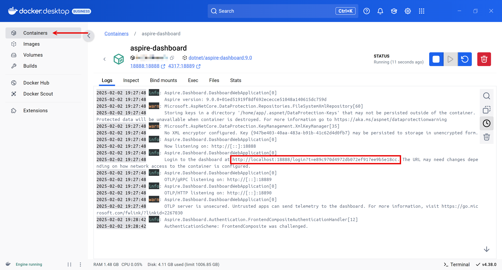
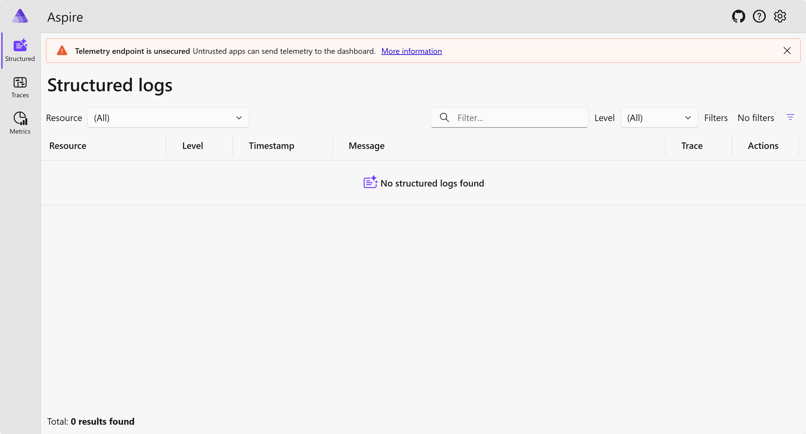
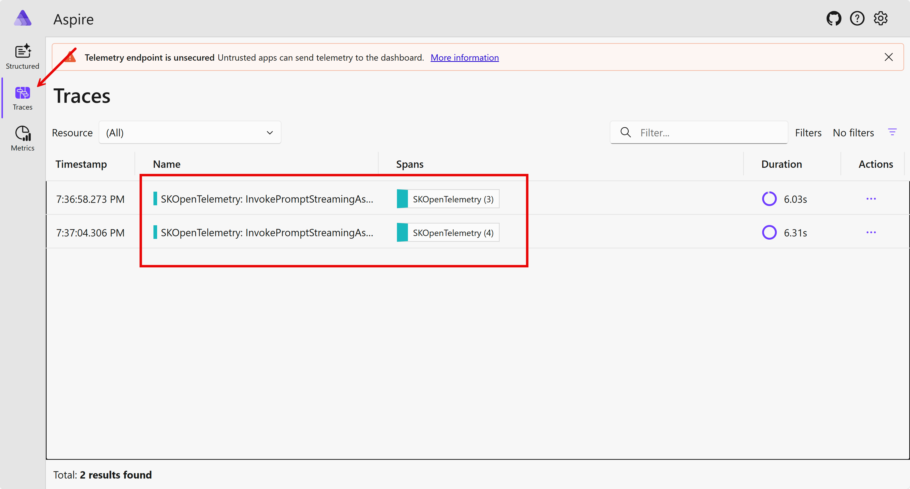
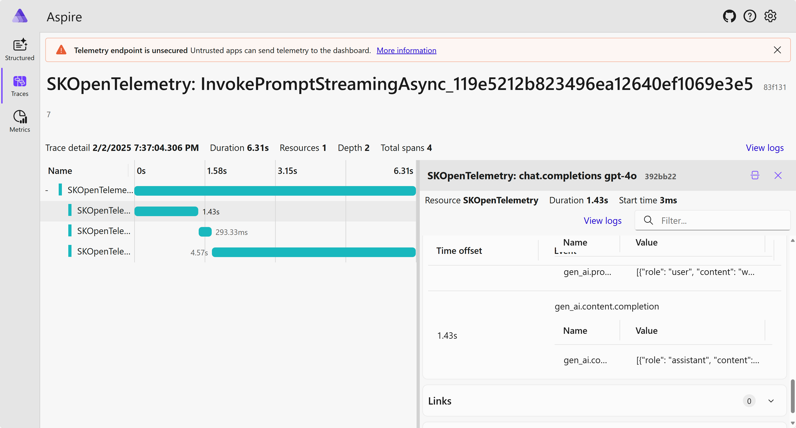

# STEP 04: Semantic Kernel RAG 및 모니터링

이 단계에서는 Semantic Kernel에 벡터 데이터베이스를 추가해서 RAG(Retrieval Augmented Generation; 검색증강생성)를 구현하고 이를 모니터링하는 실습을 합니다.

## 세션 목표

- Semantic Kernel을 활용한 간단한 콘솔 앱을 개발할 수 있습니다.
- Semantic Kernel에 RAG 기능을 추가할 수 있습니다.
- Semantic Kernel 애플리케이션을 모니터링할 수 있습니다.

## 사전 준비 사항

이전 [STEP 00: 개발 환경 설정하기](./step-00.md)에서 개발 환경을 모두 설정한 상태라고 가정합니다.

## 리포지토리 루트 설정

1. 아래 명령어를 실행시켜 `$REPOSITORY_ROOT` 환경 변수를 설정합니다.

    ```bash
    # Bash/Zsh
    REPOSITORY_ROOT=$(git rev-parse --show-toplevel)
    ```

    ```powershell
    # PowerShell
    $REPOSITORY_ROOT = git rev-parse --show-toplevel
    ```

## 시작 프로젝트 복사

이 워크샵을 위해 필요한 시작 프로젝트를 준비해 뒀습니다. 이 프로젝트가 제대로 작동하는지 확인합니다. 시작 프로젝트의 프로젝트 구조는 아래와 같습니다.

```text
Workshop
└── Workshop.ConsoleApp
```

1. 앞서 실습한 `workshop` 디렉토리가 있다면 삭제하거나 다른 이름으로 바꿔주세요. 예) `workshop-step-03`
1. 터미널을 열고 아래 명령어를 차례로 실행시켜 실습 디렉토리를 만들고 시작 프로젝트를 복사합니다.

    ```bash
    # Bash/Zsh
    mkdir -p $REPOSITORY_ROOT/workshop && \
        cp -a $REPOSITORY_ROOT/save-points/step-04/start/. $REPOSITORY_ROOT/workshop/
    ```

    ```powershell
    # PowerShell
    New-Item -Type Directory -Path $REPOSITORY_ROOT/workshop -Force && `
        Copy-Item -Path $REPOSITORY_ROOT/save-points/step-04/start/* -Destination $REPOSITORY_ROOT/workshop -Recurse -Force
    ```

## 시작 프로젝트 빌드 및 실행

1. 워크샵 디렉토리에 있는지 다시 한 번 확인합니다.

    ```bash
    cd $REPOSITORY_ROOT/workshop
    ```

1. 전체 프로젝트를 빌드합니다.

    ```bash
    dotnet restore && dotnet build
    ```

1. 이전 [STEP 00: 개발 환경 설정하기](./step-00.md)에서 생성한 API 액세스 토큰을 콘솔 앱에 등록합니다.

    ```bash
    dotnet user-secrets --project ./Workshop.ConsoleApp/ set GitHub:Models:AccessToken {{GitHub Models Access Token}}
    ```

1. 애플리케이션을 실행합니다.

    ```bash
    dotnet run --project ./Workshop.ConsoleApp
    ```

1. `User:` 라는 프롬프트가 보이면 `What is Semantic Kernel?` 이라고 입력합니다.
1. `Assistant: ` 프롬프트에 응답이 표시되는 것을 확인합니다.
1. 다시 `User: ` 프롬프트가 보이면 아무것도 입력하지 않고 엔터키를 눌러 콘솔 앱을 종료합니다.

## 벡터 스토어 연결하기

Semantic Kernel에 In-Memory 벡터 데이터베이스를 연결합니다.

1. 워크샵 디렉토리에 있는지 다시 한 번 확인합니다.

    ```bash
    cd $REPOSITORY_ROOT/workshop
    ```

1. 콘솔 앱 프로젝트에 In-Memory 벡터 데이터베이스 패키지 라이브러리를 추가합니다.

    ```bash
    dotnet add ./Workshop.ConsoleApp package Microsoft.SemanticKernel.Connectors.InMemory --prerelease
    ```

1. 아래 명령어를 실행시켜 `Workshop.ConsoleApp/Models/DataModel.cs` 파일과 `Workshop.ConsoleApp/Services/TextSearchService.cs` 파일을 생성합니다.

    ```bash
    # Bash/Zsh
    mkdir -p $REPOSITORY_ROOT/workshop/Workshop.ConsoleApp/Models && \
        mkdir -p $REPOSITORY_ROOT/workshop/Workshop.ConsoleApp/Services && \
        touch $REPOSITORY_ROOT/workshop/Workshop.ConsoleApp/Models/DataModel.cs && \
        touch $REPOSITORY_ROOT/workshop/Workshop.ConsoleApp/Services/TextSearchService.cs
    ```

    ```powershell
    # PowerShell
    New-Item -Type Directory -Path $REPOSITORY_ROOT/workshop/Workshop.ConsoleApp/Models/ && `
        New-Item -Type Directory -Path $REPOSITORY_ROOT/workshop/Workshop.ConsoleApp/Services/ && `
        New-Item -Type File -Path $REPOSITORY_ROOT/workshop/Workshop.ConsoleApp/Models/DataModel.cs -Force && `
        New-Item -Type File -Path $REPOSITORY_ROOT/workshop/Workshop.ConsoleApp/Services/TextSearchService.cs -Force
    ```

1. `Workshop.ConsoleApp/Models/DataModel.cs` 파일을 열어 아래 내용을 입력합니다.

    ```csharp
    using Microsoft.Extensions.VectorData;
    using Microsoft.SemanticKernel.Data;
    
    namespace Workshop.ConsoleApp.Models;
    
    public class DataModel
    {
        [VectorStoreRecordKey]
        [TextSearchResultName]
        public Guid Key { get; init; }
    
        [VectorStoreRecordData]
        [TextSearchResultValue]
        public string? Text { get; init; }
    
        [VectorStoreRecordData]
        [TextSearchResultLink]
        public string? Link { get; init; }
    
        [VectorStoreRecordData(IsFilterable = true)]
        public required string Tag { get; init; }
    
        [VectorStoreRecordVector]
        public ReadOnlyMemory<float> Embedding { get; init; }
    }
    ```

1. `Workshop.ConsoleApp/Services/TextSearchService.cs` 파일을 열어 아래 내용을 입력합니다.

    ```csharp
    using System.ClientModel;
    
    using Azure;
    using Azure.AI.OpenAI;
    
    using Microsoft.Extensions.Configuration;
    using Microsoft.Extensions.VectorData;
    using Microsoft.SemanticKernel.Connectors.AzureOpenAI;
    using Microsoft.SemanticKernel.Connectors.InMemory;
    using Microsoft.SemanticKernel.Connectors.OpenAI;
    using Microsoft.SemanticKernel.Data;
    using Microsoft.SemanticKernel.Embeddings;
    
    using OpenAI;
    
    using Workshop.ConsoleApp.Models;
    
    namespace Workshop.ConsoleApp.Services;
    
    public class TextSearchService(IConfiguration config)
    {
        private static readonly string[] entries =
        [
            "Semantic Kernel is a lightweight, open-source development kit that lets you easily build AI agents and integrate the latest AI models into your C#, Python, or Java codebase. It serves as an efficient middleware that enables rapid delivery of enterprise-grade solutions.",
            "Semantic Kernel is a new AI SDK, and a simple and yet powerful programming model that lets you add large language capabilities to your app in just a matter of minutes. It uses natural language prompting to create and execute semantic kernel AI tasks across multiple languages and platforms.",
            "In this guide, you learned how to quickly get started with Semantic Kernel by building a simple AI agent that can interact with an AI service and run your code. To see more examples and learn how to build more complex AI agents, check out our in-depth samples.",
            "The Semantic Kernel extension for Visual Studio Code makes it easy to design and test semantic functions.The extension provides an interface for designing semantic functions and allows you to test them with the push of a button with your existing models and data.",
            "The kernel is the central component of Semantic Kernel.At its simplest, the kernel is a Dependency Injection container that manages all of the services and plugins necessary to run your AI application.",
            "Semantic Kernel (SK) is a lightweight SDK that lets you mix conventional programming languages, like C# and Python, with the latest in Large Language Model (LLM) AI “prompts” with prompt templating, chaining, and planning capabilities.",
            "Semantic Kernel is a lightweight, open-source development kit that lets you easily build AI agents and integrate the latest AI models into your C#, Python, or Java codebase. It serves as an efficient middleware that enables rapid delivery of enterprise-grade solutions. Enterprise ready.",
            "With Semantic Kernel, you can easily build agents that can call your existing code.This power lets you automate your business processes with models from OpenAI, Azure OpenAI, Hugging Face, and more! We often get asked though, “How do I architect my solution?” and “How does it actually work?”"
        ];
    
        public async Task<IVectorStoreRecordCollection<Guid, DataModel>> GetVectorStoreRecordCollectionAsync(string collectionName)
        {
            var store = new InMemoryVectorStore();
            var collection = store.GetCollection<Guid, DataModel>(collectionName);
            await collection.CreateCollectionIfNotExistsAsync().ConfigureAwait(false);
    
            return collection;
        }
    
        public async Task<VectorStoreTextSearch<DataModel>> GetVectorStoreTextSearchAsync(IVectorStoreRecordCollection<Guid, DataModel> collection)
        {
            var embeddingsService = default(ITextEmbeddingGenerationService);
            if (string.IsNullOrWhiteSpace(config["Azure:OpenAI:Endpoint"]!) == false)
            {
                var embeddingsClient = new AzureOpenAIClient(
                    new Uri(config["Azure:OpenAI:Endpoint"]!),
                    new AzureKeyCredential(config["Azure:OpenAI:ApiKey"]!));
    
    
                embeddingsService = new AzureOpenAITextEmbeddingGenerationService(
                    deploymentName: config["Azure:OpenAI:DeploymentNames:Embeddings"]!,
                    azureOpenAIClient: embeddingsClient
                );
            }
            else
            {
                var embeddingsClient = new OpenAIClient(
                    new ApiKeyCredential(config["GitHub:Models:AccessToken"]!),
                    new OpenAIClientOptions { Endpoint = new Uri(config["GitHub:Models:Endpoint"]!) });
    
                embeddingsService = new OpenAITextEmbeddingGenerationService(
                    modelId: config["GitHub:Models:ModelIds:Embeddings"]!,
                    openAIClient: embeddingsClient);
            }
    
            for (var i = 0; i < entries.Length; i++)
            {
                var entry = entries[i];
                var embedding = await embeddingsService.GenerateEmbeddingAsync(entry).ConfigureAwait(false);
    
                var guid = Guid.NewGuid();
                var record = new DataModel()
                {
                    Key = guid,
                    Text = entry,
                    Link = $"guid://{guid}",
                    Tag = i % 2 == 0 ? "Even" : "Odd",
                    Embedding = embedding
                };
    
                await collection.UpsertAsync(record).ConfigureAwait(false);
            }
    
            var search = new VectorStoreTextSearch<DataModel>(collection, embeddingsService);
    
            return search;
        }
    }
    ```

## 벡터 스토어에 저장된 데이터를 직접 검색하기

Semantic Kernel에 In-Memory 벡터 데이터베이스에 저장되어 있는 데이터 기반으로 자료를 검색합니다.

1. 워크샵 디렉토리에 있는지 다시 한 번 확인합니다.

    ```bash
    cd $REPOSITORY_ROOT/workshop
    ```

1. `Workshop.ConsoleApp/Program.cs` 파일을 열고 `using Microsoft.SemanticKernel;` 라인을 찾아 아래 코드를 입력합니다.

    ```csharp
    using System.ClientModel;

    using Azure;
    using Azure.AI.OpenAI;

    using Microsoft.Extensions.Configuration;
    using Microsoft.SemanticKernel;

    // 👇👇👇 아래 코드를 입력하세요
    using Microsoft.SemanticKernel.Data;
    
    using Workshop.ConsoleApp.Services;
    // 👆👆👆 위 코드를 입력하세요
    
    using OpenAI;
    ```

1. `Workshop.ConsoleApp/Program.cs` 파일에서 `var input = default(string);` 라인을 찾아 아래 코드를 입력합니다.

    ```csharp
    // 👇👇👇 아래 코드를 입력하세요
    var service = new TextSearchService(config);
    var collection = await service.GetVectorStoreRecordCollectionAsync("records");
    var search = await service.GetVectorStoreTextSearchAsync(collection);
    // 👆👆👆 위 코드를 입력하세요

    var input = default(string);
    ```

1. `Workshop.ConsoleApp/Program.cs` 파일에서 `Console.Write("User: ");` 라인을 찾아 아래 코드를 입력합니다.

    ```csharp
    // 👇👇👇 아래 코드를 입력하세요
    Console.WriteLine("Ask a question about semantic kernel.");
    // 👆👆👆 위 코드를 입력하세요
    
    Console.Write("User: ");
    ```

1. `Workshop.ConsoleApp/Program.cs` 파일에서 `Console.Write("Assistant: ");` 라인을 찾아 아래 코드를 입력합니다.

    ```csharp
    Console.Write("Assistant: ");

    // 👇👇👇 아래 코드를 삭제하세요
    var response = kernel.InvokePromptStreamingAsync(input);
    await foreach (var content in response)
    {
        await Task.Delay(20);
        message += content;
        Console.Write(content);
    }
    // 👆👆👆 위 코드를 삭제하세요
    
    // 👇👇👇 아래 코드를 추가하세요
    var searchResponse = await search.GetTextSearchResultsAsync(input, new TextSearchOptions() { Top = 2, Skip = 0 });
    Console.WriteLine("\n--- Text Search Results ---\n");
    await foreach (var result in searchResponse.Results)
    {
        Console.WriteLine($"Name:  {result.Name}");
        Console.WriteLine($"Value: {result.Value}");
        Console.WriteLine($"Link:  {result.Link}");
        Console.WriteLine();
    }
    // 👆👆👆 위 코드를 추가하세요
    ```

1. 파일을 저장한 후 콘솔 앱을 실행시킵니다.

    ```bash
    dotnet run --project ./Workshop.ConsoleApp
    ```

1. `User:` 라는 프롬프트가 보이면 `What is Semantic Kernel?` 이라고 입력합니다.
1. `Assistant: ` 프롬프트에 응답이 표시되는 것을 확인합니다. 그리고 앞서 벡터 스토어를 연결시키기 전에 실행시켰던 응답과 비교해 봅니다.
1. 다시 `User: ` 프롬프트가 보이면 아무것도 입력하지 않고 엔터키를 눌러 콘솔 앱을 종료합니다.
1. 혹시 GitHub Models에서 토큰 사용량 초과 관련 에러가 나오면 아래 섹션 [Troubleshooting : GitHub Models를 Google Gemini로 대체하기](#troubleshooting--github-models를-google-gemini로-대체하기)를 참고해서 Google Gemini로 바꾼 후에 다시 실행해 보세요.

## 벡터 스토어에 저장된 데이터를 채팅으로 검색하기

Semantic Kernel에 In-Memory 벡터 데이터베이스에 저장되어 있는 데이터 기반으로 챗봇을 활용해 검색합니다.

1. 워크샵 디렉토리에 있는지 다시 한 번 확인합니다.

    ```bash
    cd $REPOSITORY_ROOT/workshop
    ```

1. 콘솔 앱 프로젝트에 프롬프트 템플릿 패키지 라이브러리를 추가합니다.

    ```bash
    dotnet add ./Workshop.ConsoleApp package Microsoft.SemanticKernel.PromptTemplates.Handlebars
    ```

1. `Workshop.ConsoleApp/Program.cs` 파일을 열고 `using OpenAI;` 라인을 찾아 아래 코드를 입력합니다.

    ```csharp
    // 👇👇👇 아래 코드를 입력하세요
    using Microsoft.SemanticKernel.PromptTemplates.Handlebars;
    // 👆👆👆 위 코드를 입력하세요
    
    using OpenAI;
    ```

1. `Workshop.ConsoleApp/Program.cs` 파일에서 `var input = default(string);` 라인을 찾아 아래 코드를 입력합니다.

    ```csharp
    // 👇👇👇 아래 코드를 입력하세요
    var plugin = search.CreateWithGetTextSearchResults("SearchPlugin");
    kernel.Plugins.Add(plugin);
    
    var promptTemplate = """
        {{#with (SearchPlugin-GetTextSearchResults query)}}  
            {{#each this}}  
            Name: {{Name}}
            Value: {{Value}}
            Link: {{Link}}
            -----------------
            {{/each}}  
        {{/with}}  
    
        {{query}}
    
        Include citations to the relevant information where it is referenced in the response.
        """;
    // 👆👆👆 위 코드를 입력하세요

    var input = default(string);
    ```

1. `Workshop.ConsoleApp/Program.cs` 파일에서 `Console.Write("Assistant: ");` 라인을 찾아 아래 코드를 입력합니다.

    ```csharp
    await foreach (var result in searchResponse.Results)
    {
        ...
    }

    // 👇👇👇 아래 코드를 입력하세요
    var promptArguments = new KernelArguments()
    {
        { "query", input }
    };

    var promptResponse = kernel.InvokePromptStreamingAsync(
        promptTemplate: promptTemplate,
        arguments: promptArguments,
        templateFormat: HandlebarsPromptTemplateFactory.HandlebarsTemplateFormat,
        promptTemplateFactory: new HandlebarsPromptTemplateFactory());

    Console.WriteLine("\n--- Text Search Results from Chat Completions ---\n");
    await foreach (var content in promptResponse)
    {
        await Task.Delay(20);
        message += content;
        Console.Write(content);
    }
    Console.WriteLine();
    // 👆👆👆 위 코드를 입력하세요
    ```

1. 파일을 저장한 후 콘솔 앱을 실행시킵니다.

    ```bash
    dotnet run --project ./Workshop.ConsoleApp
    ```

1. `User:` 라는 프롬프트가 보이면 `What is Semantic Kernel?` 이라고 입력합니다.
1. `Assistant: ` 프롬프트에 두 가지 형태로 응답이 표시되는 것을 확인합니다. 그리고 두 답변을 비교해 봅니다.
1. 다시 `User: ` 프롬프트가 보이면 아무것도 입력하지 않고 엔터키를 눌러 콘솔 앱을 종료합니다.
1. 혹시 GitHub Models에서 토큰 사용량 초과 관련 에러가 나오면 아래 섹션 [Troubleshooting : GitHub Models를 Google Gemini로 대체하기](#troubleshooting--github-models를-google-gemini로-대체하기)를 참고해서 Google Gemini로 바꾼 후에 다시 실행해 보세요.

## 벡터 스토어에 저장된 데이터를 자동 호출 기능을 추가한 채팅으로 검색하기

Semantic Kernel에 In-Memory 벡터 데이터베이스에 저장되어 있는 데이터 기반으로 자동 호출 챗봇을 활용해 검색합니다.

1. 워크샵 디렉토리에 있는지 다시 한 번 확인합니다.

    ```bash
    cd $REPOSITORY_ROOT/workshop
    ```

1. `Workshop.ConsoleApp/Program.cs` 파일을 열고 `var input = default(string);` 라인을 찾아 아래 코드를 입력합니다.

    ```csharp
    // 👇👇👇 아래 코드를 입력하세요
    var settings = new PromptExecutionSettings()
    {
        FunctionChoiceBehavior = FunctionChoiceBehavior.Auto()
    };
    // 👆👆👆 위 코드를 입력하세요

    var input = default(string);
    ```

1. `Workshop.ConsoleApp/Program.cs` 파일에서 `Console.Write("Assistant: ");` 라인을 찾아 아래 코드를 입력합니다.

    ```csharp
    await foreach (var content in promptResponse)
    {
        ...
    }

    // 👇👇👇 아래 코드를 입력하세요
    var functionCallingArguments = new KernelArguments(settings);

    var functionCalingResponse = kernel.InvokePromptStreamingAsync(
        promptTemplate: input,
        arguments: functionCallingArguments);

    Console.WriteLine("\n--- Text Search Results from Chat Completions with Auto Function Calling ---\n");
    await foreach (var content in functionCalingResponse)
    {
        await Task.Delay(20);
        message += content;
        Console.Write(content);
    }
    Console.WriteLine();
    // 👆👆👆 위 코드를 입력하세요
    ```

1. 파일을 저장한 후 콘솔 앱을 실행시킵니다.

    ```bash
    dotnet run --project ./Workshop.ConsoleApp
    ```

1. `User:` 라는 프롬프트가 보이면 `What is Semantic Kernel?` 이라고 입력합니다.
1. `Assistant: ` 프롬프트에 세 가지 형태로 응답이 표시되는 것을 확인합니다. 그리고 세 답변을 비교해 봅니다.
1. 다시 `User: ` 프롬프트가 보이면 아무것도 입력하지 않고 엔터키를 눌러 콘솔 앱을 종료합니다.
1. 혹시 GitHub Models에서 토큰 사용량 초과 관련 에러가 나오면 아래 섹션 [Troubleshooting : GitHub Models를 Google Gemini로 대체하기](#troubleshooting--github-models를-google-gemini로-대체하기)를 참고해서 Google Gemini로 바꾼 후에 다시 실행해 보세요.

## 채팅 결과를 모니터링하기

Semantic Kernel을 활용한 챗봇 호출 결과를 [.NET Aspire 대시보드](https://learn.microsoft.com/dotnet/aspire/fundamentals/dashboard/standalone)를 이용해 모니터링합니다.

1. Docker Desktop 애플리케이션이 돌고 있는지 다시 한 번 확인합니다. 아래 명령어를 실행시켰을 때 커넥션 에러가 생긴다면 Docker Desktop을 실행시켜 주세요.

    ```bash
    docker version
    ```

1. 워크샵 디렉토리에 있는지 다시 한 번 확인합니다.

    ```bash
    cd $REPOSITORY_ROOT/workshop
    ```

1. 콘솔 앱 프로젝트에 모니터링 및 로깅 관련 패키지 라이브러리를 추가합니다.

    ```bash
    dotnet add ./Workshop.ConsoleApp package OpenTelemetry.Exporter.Console
    dotnet add ./Workshop.ConsoleApp package OpenTelemetry.Exporter.OpenTelemetryProtocol
    ```

1. `Workshop.ConsoleApp/Program.cs` 파일을 열고 `using System.ClientModel;` 라인을 찾아 아래 코드를 입력합니다.

    ```csharp
    using System.ClientModel;

    using Azure;
    using Azure.AI.OpenAI;
    
    // 👇👇👇 아래 코드를 삭제하세요
    using Microsoft.Extensions.Configuration;
    using Microsoft.SemanticKernel;
    using Microsoft.SemanticKernel.Data;
    using Microsoft.SemanticKernel.PromptTemplates.Handlebars;
    
    using OpenAI;

    using Workshop.ConsoleApp.Services;
    // 👆👆👆 위 코드를 삭제하세요
    
    // 👇👇👇 아래 코드를 추가하세요
    using Microsoft.Extensions.Configuration;
    using Microsoft.Extensions.DependencyInjection;
    using Microsoft.Extensions.Logging;
    using Microsoft.SemanticKernel;
    using Microsoft.SemanticKernel.Data;
    using Microsoft.SemanticKernel.PromptTemplates.Handlebars;
    
    using OpenAI;
    
    using OpenTelemetry;
    using OpenTelemetry.Logs;
    using OpenTelemetry.Metrics;
    using OpenTelemetry.Resources;
    using OpenTelemetry.Trace;

    using Workshop.ConsoleApp.Services;
    // 👆👆👆 위 코드를 추가하세요
    ```

1. `Workshop.ConsoleApp/Program.cs` 파일에서서 `var builder = Kernel.CreateBuilder();` 라인을 찾아 아래 코드를 입력합니다.

    ```csharp
    // 👇👇👇 아래 코드를 입력하세요
    var dashboardEndpoint = config["Aspire:Dashboard:Endpoint"]!;
    var resourceBuilder = ResourceBuilder.CreateDefault()
                                         .AddService("SKOpenTelemetry");
    
    // Enable model diagnostics with sensitive data.
    AppContext.SetSwitch("Microsoft.SemanticKernel.Experimental.GenAI.EnableOTelDiagnosticsSensitive", true);
    
    using var traceProvider = Sdk.CreateTracerProviderBuilder()
                                 .SetResourceBuilder(resourceBuilder)
                                 .AddSource("Microsoft.SemanticKernel*")
                                 .AddConsoleExporter()
                                 .AddOtlpExporter(options => options.Endpoint = new Uri(dashboardEndpoint))
                                 .Build();
    
    using var meterProvider = Sdk.CreateMeterProviderBuilder()
                                 .SetResourceBuilder(resourceBuilder)
                                 .AddMeter("Microsoft.SemanticKernel*")
                                 .AddConsoleExporter()
                                 .AddOtlpExporter(options => options.Endpoint = new Uri(dashboardEndpoint))
                                 .Build();
    
    using var loggerFactory = LoggerFactory.Create(builder =>
    {
        // Add OpenTelemetry as a logging provider
        builder.AddOpenTelemetry(options =>
        {
            options.SetResourceBuilder(resourceBuilder);
            options.AddConsoleExporter();
            options.AddOtlpExporter(options => options.Endpoint = new Uri(dashboardEndpoint));
            // Format log messages. This is default to false.
            options.IncludeFormattedMessage = true;
            options.IncludeScopes = true;
        });
        builder.SetMinimumLevel(LogLevel.Information);
    });
    // 👆👆👆 위 코드를 입력하세요
    
    var builder = Kernel.CreateBuilder();

    // 👇👇👇 아래 코드를 입력하세요
    builder.Services.AddSingleton(loggerFactory);
    // 👆👆👆 위 코드를 입력하세요
    ```

1. 아래 명령어를 실행시켜 .NET Aspire 대시보드를 컨테이너로 실행시킵니다.

    ```bash
    docker run --rm -it -d -p 18888:18888 -p 4317:18889 --name aspire-dashboard mcr.microsoft.com/dotnet/aspire-dashboard:9.0
    ```

1. Docker Desktop을 열고 아래와 같이 현재 실행중인 .NET Aspire 대시보드의 로그를 클릭합니다. 그리고 `http://localhost:18888/login?t=xxx` 링크를 클릭해서 웹 브라우저로 이동합니다.

   

   > GitHub Codespaces를 사용하는 경우에는 아래와 같이 .NET Aspire 대시보드에 접속합니다.
   > 
   > 1. `docker ps` 명령어를 실행시켜 아래와 같은 데이터가 나오는지 확인합니다. `CONTAINER ID` 값은 다를 수 있습니다.
   > 
   >     ```bash
   >     CONTAINER ID   IMAGE                                           COMMAND
   >     da5352cbe331   mcr.microsoft.com/dotnet/aspire-dashboard:9.0   "dotnet /app/Aspire.…"
   >     ```
   > 
   > 1. `docker logs {{CONTAINER_ID}}` 명령어를 실행시켜 컨테이너 로그를 출력합니다. 이 때 `{{CONTAINER_ID}}` 값은 앞서 `docker ps` 명령어로 확인한 `CONTAINER ID` 값입니다.
   > 1. 컨테이너 로그에서 `http://localhost:18888/login?t=xxx`와 같은 링크를 찾아 클릭해서 .NET Aspire 대시보드를 새 탭에서 엽니다. 혹시 token 값을 물어보면 로그 화면에서 `?t=xxx`와 같은 부분을 찾아 `xxx`값을 복사해서 붙여넣기 합니다.

1. 웹 브라우저에서 .NET Aspire 대시보드를 확인합니다.

   

1. 콘솔 앱을 실행시킵니다.

    ```bash
    dotnet run --project ./Workshop.ConsoleApp
    ```

1. `User:` 라는 프롬프트가 보이면 `What is Semantic Kernel?` 이라고 입력합니다.
1. `Assistant: ` 프롬프트에 세 가지 형태로 응답이 표시되는 것을 확인합니다. 그리고 세 답변을 비교해 봅니다.
1. 다시 `User: ` 프롬프트가 보이면 아무것도 입력하지 않고 엔터키를 눌러 콘솔 앱을 종료합니다.
1. .NET Aspire 대시보드에서 데이터 트레이싱 결과를 확인합니다.

   

   
1. 혹시 GitHub Models에서 토큰 사용량 초과 관련 에러가 나오면 아래 섹션 [Troubleshooting : GitHub Models를 Google Gemini로 대체하기](#troubleshooting--github-models를-google-gemini로-대체하기)를 참고해서 Google Gemini로 바꾼 후에 다시 실행해 보세요.

## Troubleshooting : GitHub Models를 Google Gemini로 대체하기

만약 GitHub Models의 토큰을 모두 사용했다면 화면에 토큰 사용량 초과 관련 에러가 나타납니다. 이 경우, GitHub Models 대신 앞서 [STEP 01: Semantic Kernel 기본 작동법](./step-01.md)에서 사용했었던 Google Gemini를 사용합니다.

1. 먼저 워크샵 디렉토리에 있는지 다시 한 번 확인합니다. 

    ```bash
    cd $REPOSITORY_ROOT/workshop
    ```

1. 콘솔 앱 프로젝트에 Google 커넥터 패키지 라이브러리를 추가합니다.

    ```bash
    dotnet add ./Workshop.ConsoleApp package Microsoft.SemanticKernel.Connectors.Google --prerelease
    ```

1. 이전 [STEP 00: 개발 환경 설정하기](./step-00.md)에서 생성한 API 액세스 토큰을 콘솔 앱에 등록합니다.

    ```bash
    dotnet user-secrets --project ./Workshop.ConsoleApp/ set Google:Gemini:ApiKey {{Google Gemini API Key}}
    ```

1. `Workshop.ConsoleApp/Program.cs`의 `var builder = Kernel.CreateBuilder();` 부분을 찾아 아래와 같이 수정합니다.

    ```csharp
    var builder = Kernel.CreateBuilder();
    
    // 👇👇👇 아래 내용을 삭제합니다. 
    if (string.IsNullOrWhiteSpace(config["Azure:OpenAI:Endpoint"]!) == false)
    {
        var client = new AzureOpenAIClient(
            new Uri(config["Azure:OpenAI:Endpoint"]!),
            new AzureKeyCredential(config["Azure:OpenAI:ApiKey"]!));

        builder.AddAzureOpenAIChatCompletion(
            deploymentName: config["Azure:OpenAI:DeploymentNames:ChatCompletion"]!,
            azureOpenAIClient: client
        );
    }
    else
    {
        var client = new OpenAIClient(
            credential: new ApiKeyCredential(config["GitHub:Models:AccessToken"]!),
            options: new OpenAIClientOptions { Endpoint = new Uri(config["GitHub:Models:Endpoint"]!) }
        );

        builder.AddOpenAIChatCompletion(
            modelId: config["GitHub:Models:ModelIds:ChatCompletion"]!,
            openAIClient: client
        );
    }
    // 👆👆👆 위 내용을 삭제합니다.

    // 👇👇👇 아래 내용을 추가합니다. 
    builder.AddGoogleAIGeminiChatCompletion(
            modelId: config["Google:Gemini:ModelIds:ChatCompletion"]!,
            apiKey: config["Google:Gemini:ApiKey"]!
        );
    // 👆👆👆 위 내용을 추가합니다. 
    ```
1. `Workshop.ConsoleApp/Services/TextSearchService.cs`의 `using Microsoft.SemanticKernel.Data;` 부분을 찾아 아래와 같이 수정합니다.

    ```csharp
    using Microsoft.SemanticKernel.Data;
    using Microsoft.SemanticKernel.Embeddings;
    // 👇👇👇 아래 내용을 추가합니다. 
    using Microsoft.SemanticKernel.Connectors.Google;
    // 👆👆👆 위 내용을 추가합니다. 
    ```

1. `Workshop.ConsoleApp/Services/TextSearchService.cs`의 `var embeddingsService = default(ITextEmbeddingGenerationService);` 부분을 찾아 아래와 같이 수정합니다.

    ```csharp
    var embeddingsService = default(ITextEmbeddingGenerationService);

    // 👇👇👇 아래 내용을 삭제합니다. 
    if (string.IsNullOrWhiteSpace(config["Azure:OpenAI:Endpoint"]!) == false)
    {
        var embeddingsClient = new AzureOpenAIClient(
            new Uri(config["Azure:OpenAI:Endpoint"]!),
            new AzureKeyCredential(config["Azure:OpenAI:ApiKey"]!)
        );


        embeddingsService = new AzureOpenAITextEmbeddingGenerationService(
            deploymentName: config["Azure:OpenAI:DeploymentNames:Embeddings"]!,
            azureOpenAIClient: embeddingsClient
        );
    }
    else
    {
        var embeddingsClient = new OpenAIClient(
            new ApiKeyCredential(config["GitHub:Models:AccessToken"]!),
            new OpenAIClientOptions { Endpoint = new Uri(config["GitHub:Models:Endpoint"]!) }
        );

        embeddingsService = new OpenAITextEmbeddingGenerationService(
            modelId: config["GitHub:Models:ModelIds:Embeddings"]!,
            openAIClient: embeddingsClient
        );
    }
    // 👆👆👆 위 내용을 삭제합니다. 

    // 👇👇👇 아래 내용을 추가합니다. 
    embeddingsService = new GoogleAITextEmbeddingGenerationService(
        modelId: config["Google:Gemini:ModelIds:Embeddings"]!,
        apiKey: config["Google:Gemini:ApiKey"]!
    );
    // 👆👆👆 위 내용을 추가합니다. 
    ```
1. `workshop/Workshop.ConsoleApp/appsettings.json`파일의 `"Azure":` 부분을 찾아 아래와 같이 수정합니다.

    ```jsonc
    "Azure": {
      "OpenAI": {
        "DeploymentNames": {
          "ChatCompletion": "gpt-4o",
          "Embeddings": "text-embedding-3-large"
        }
      }
    },
    // 👇👇👇 아래 내용을 추가합니다. 
    "Google": {
      "Gemini": {
        "ModelIds":{
          "ChatCompletion": "gemini-1.5-pro",
          "Embeddings": "text-embedding-004"
        }
      }
    },
    // 👆👆👆 위 내용을 추가합니다. 
    ```
1. 파일을 저장한 후 콘솔 앱을 실행시킵니다.

    ```bash
    dotnet run --project ./Workshop.ConsoleApp
    ```

1. `User:` 라는 프롬프트가 보이면 `What is Semantic Kernel?` 이라고 입력합니다.

1. `Assistant:` 프롬프트에 두 가지 형태로 응답이 표시되는 것을 확인합니다. 그리고 두 답변을 비교해 봅니다.

1. 다시 `User:` 프롬프트가 보이면 아무것도 입력하지 않고 엔터키를 눌러 콘솔 앱을 종료합니다.

## 완성본 결과 확인

이 세션의 완성본은 `$REPOSITORY_ROOT/save-points/step-04/complete`에서 확인할 수 있습니다.

1. 앞서 실습한 `workshop` 디렉토리가 있다면 삭제하거나 다른 이름으로 바꿔주세요. 예) `workshop-step-04`
1. 터미널을 열고 아래 명령어를 차례로 실행시켜 실습 디렉토리를 만들고 시작 프로젝트를 복사합니다.

    ```bash
    # Bash/Zsh
    mkdir -p $REPOSITORY_ROOT/workshop && \
        cp -a $REPOSITORY_ROOT/save-points/step-04/complete/. $REPOSITORY_ROOT/workshop/
    ```

    ```powershell
    # PowerShell
    New-Item -Type Directory -Path $REPOSITORY_ROOT/workshop -Force && `
        Copy-Item -Path $REPOSITORY_ROOT/save-points/step-04/complete/* -Destination $REPOSITORY_ROOT/workshop -Recurse -Force
    ```

1. 워크샵 디렉토리로 이동합니다.

    ```bash
    cd $REPOSITORY_ROOT/workshop
    ```

1. 이전 [STEP 00: 개발 환경 설정하기](./step-00.md)에서 생성한 API 액세스 토큰을 콘솔 앱에 등록합니다.

    ```bash
    dotnet user-secrets --project ./Workshop.ConsoleApp/ set GitHub:Models:AccessToken {{GitHub Models Access Token}}
    ```

1. 콘솔 앱을 실행시킵니다.

    ```bash
    dotnet run --project ./Workshop.ConsoleApp
    ```

1. `User:` 라는 프롬프트가 보이면 `What is Semantic Kernel?` 이라고 입력합니다.
1. `Assistant: ` 프롬프트에 세 가지 형태로 응답이 표시되는 것을 확인합니다. 그리고 세 답변을 비교해 봅니다.
1. 다시 `User: ` 프롬프트가 보이면 아무것도 입력하지 않고 엔터키를 눌러 콘솔 앱을 종료합니다.
1. 웹 브라우저에서 .NET Aspire 대시보드에 접속한 후 ([https://localhost:18888](https://localhost:18888)) 데이터 트레이싱 결과를 확인합니다.

## 👉👉 도전 과제 👈👈

- [STEP 03: Semantic Kernel 에이전트 만들기](./step-03.md)의 가장 마지막 단계였던 에이전트간 협업 시나리오에 이.NET Aspire 모니터링 도구를 연결하고 트레이싱 데이터를 확인해 보세요.

## 추가 학습 자료

- [Semantic Kernel에 벡터 데이터베이스 연결하고 RAG 구현하기](https://learn.microsoft.com/semantic-kernel/concepts/text-search/text-search-vector-stores)
- [Semantic Kernel에서 가시성 확보하기](https://learn.microsoft.com/semantic-kernel/concepts/enterprise-readiness/observability/)
- [.NET Aspire 대시보드](https://learn.microsoft.com/dotnet/aspire/fundamentals/dashboard/standalone)

---

축하합니다! **Semantic Kernel RAG 및 모니터링** 실습이 끝났습니다. 이제 여러분은 Semantic Kernel을 활용해서 애플리케이션을 좀 더 똑똑하게 만들 수 있는 다양한 방법을 알게 됐습니다. 이제 직접 여러분의 애플리케이션을 개발해 보세요!
